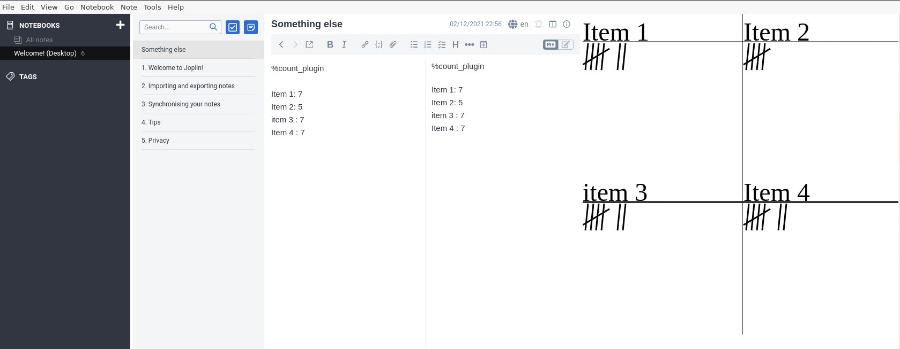

# Joplin Count Plugin

This is a one-day-build Joplin plugin that allows you to count with taste.



Is it sensible? ... Hm... Is it fun? ... Hell yeah!

Almost a mandatory tool when doing stochastic experiments like Bernoulli trials.

1. Install the plugin. For this you need to build it. Right now it is not a published plugin (not stable enough for that)
2. Create a note and write `%count_plugin` in the first line
3. Then write categories, that you want to count. One category per line with a colon and a number
```
Category 1 : 0
Category 2 : 1
```
4. Left click will increment the number
5. Right click will decrement it

Note, that the counts in the note body are not updated in time. You need to click on another note and then return to it to see the latest update. This will be fixed when we can easily send data from the webview to the plugin, which is already supported by the current pre-release of Joplin, but not yet part of the mainstream API.

## Why?

I always wanted to play with the Joplin plugin API, since I am an impassioned user of this tool. I also needed to do a number of stochastic experiments by hand and wanted to take notes as stylishly as possible.

The main two files you will want to look at are:

- `/src/index.ts`, which contains the entry point for the plugin source code.
- `/src/manifest.json`, which is the plugin manifest. It contains information such as the plugin a name, version, etc.

## Building the plugin

The plugin is built using Webpack, which creates the compiled code in `/dist`. A JPL archive will also be created at the root, which can use to distribute the plugin.

To build the plugin, simply run `npm run dist`.

The project is setup to use TypeScript, although you can change the configuration to use plain JavaScript.

## Updating the plugin framework

To update the plugin framework, run `npm run update`.

In general this command tries to do the right thing - in particular it's going to merge the changes in package.json and .gitignore instead of overwriting. It will also leave "/src" as well as README.md untouched.

The file that may cause problem is "webpack.config.js" because it's going to be overwritten. For that reason, if you want to change it, consider creating a separate JavaScript file and include it in webpack.config.js. That way, when you update, you only have to restore the line that include your file.
